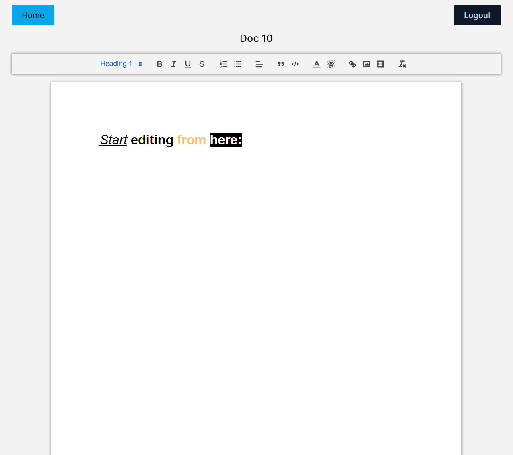

# Google Docs Clone

A Google Docs clone project that allows users to create and collaborate on documents in real time. This project is built using [React](https://reactjs.org/), [Firebase](https://firebase.google.com/), and [Socket.io](https://socket.io/).

## Table of Contents

-  [Features](#features)
-  [Demo](#demo)
-  [Getting Started](#getting-started)
-  [Technologies](#technologies)
-  [Contributing](#contributing)
-  [License](#license)

## Features

-  Sign in with Google account for authentication.
-  Create and edit documents using a react-quill.
-  Real-time collaboration allows multiple users to edit the same document simultaneously.
-  Data persistence using Firestore to save and retrieve documents.
-  Secure authentication and authorization using Firebase Auth.

## Demo

-  Demo: `https://gogol-docs.vercel.app/login`

1. **Login page:**

-  

2. **Home Page:**

-  

3. **Add New Document:**

-  

4. **Text Editor:**

-  

## Getting Started

To run this project locally, follow these steps:

1. Clone the repository: `git clone https://github.com/GolamHossain9355/gogol-docs.git`
2. Install dependencies: `npm install`
3. Set up Firebase:
   -  Create a Firebase project at [Firebase Console](https://console.firebase.google.com/).
   -  Add your Firebase config to the project.
4. Start the development server: `npm start`
5. Open your browser and go to `http://localhost:5173`.

## Usage

Welcome to the Google Docs Clone! This section will guide you through the steps to make the most of this collaborative document editing platform.

1. **Authentication:**

   -  Upon accessing the app, you'll encounter the sign-up or sign-in page. Click the prominent Google Sign In button and provide your Google email and password for authentication. This ensures secure access to the app's features.

2. **Home Page:**

   -  After signing in, you'll be directed to the home page. Here, you'll find a comprehensive overview of all your previously created documents. Each document is represented by its title, giving you an organized view of your work.

3. **Creating a Document:**

   -  To initiate a new document, simply click the "Add Document" button prominently displayed on the page. Assign a suitable title to your document, and you're all set to begin composing your content.

4. **Text Editor:**

   -  When you select a document, the app seamlessly takes you to the text editor page. Your document's previous content is effortlessly loaded from the database, providing a foundation for your edits. Feel free to shape and refine your content according to your requirements.

5. **Auto-Save Feature:**

   -  As you work on your document, the app's auto-save feature diligently ensures your progress is preserved. The text is automatically saved after 1000ms of inactivity, providing peace of mind even during moments of reflection or temporary disengagement.

6. **Real-Time Collaboration:**

   -  One of the standout features of this app is real-time collaborative editing. Leveraging the power of socket.io, multiple users can edit the same document simultaneously. To experience this, open an incognito window, sign in with a different account, and witness the seamless synchronization as multiple editors contribute to the same document.

7. **Logging In and Out:**
   -  To maintain the app's functionality, it's essential to remain logged in. Logging out will direct you back to the sign-in page, allowing you to reauthenticate swiftly and resume your work with ease.

Whether you're creating documents solo or collaborating in real-time with others, the Google Docs Clone offers a user-friendly and efficient platform for all your document editing needs.

## Reflection

-  Creating this project has been a rewarding experience that deepened my understanding of modern web development concepts. I've successfully implemented features such as Google authentication, real-time collaboration, and data persistence using Firebase Firestore.

-  Throughout the process, I navigated challenges like architecting collaborative environments, optimizing user experiences, and integrating third-party libraries. I've gained practical insights into React state management, handling concurrent updates, and ensuring smooth user interactions.

-  This project underscored the importance of user-centric design and efficient data synchronization. By creating a seamless interface for document creation and editing, I honed my skills in usability and frontend development.

-  In conclusion, this project has expanded my skill set in full-stack development and provided valuable insights into creating dynamic and user-friendly applications. I'm excited to apply these lessons to future projects and continue growing as a developer.

## Technologies

-  React
-  Typescript
-  Tailwind
-  React-Quill
-  Firebase Authentication
-  Firebase Storage
-  Socket.io
